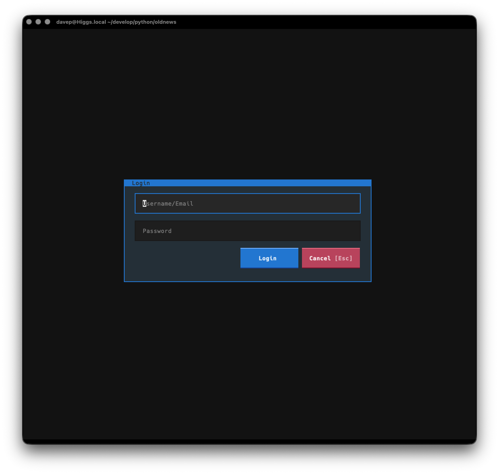

# Getting Started

OldNews only works if you have an account on
[TheOldReader](https://theoldreader.com). When you first run up OldNews you
will get a login screen:

Enter your TheOldReader login details to log in.

!!! important

    OldNews doesn't store your user name or password locally. It passes the
    details to the API of TheOldReader and then gets and locally stores a
    token for working with the API.

Once logged in TheOldReader will start to download a history of articles
form your subscriptions. From then on it will synchronise the read/unread
status as you read articles, and will refresh with the server if you request
a refresh, or when you next start the application (within a set time limit).

[//]: # (getting_started.md ends here)
