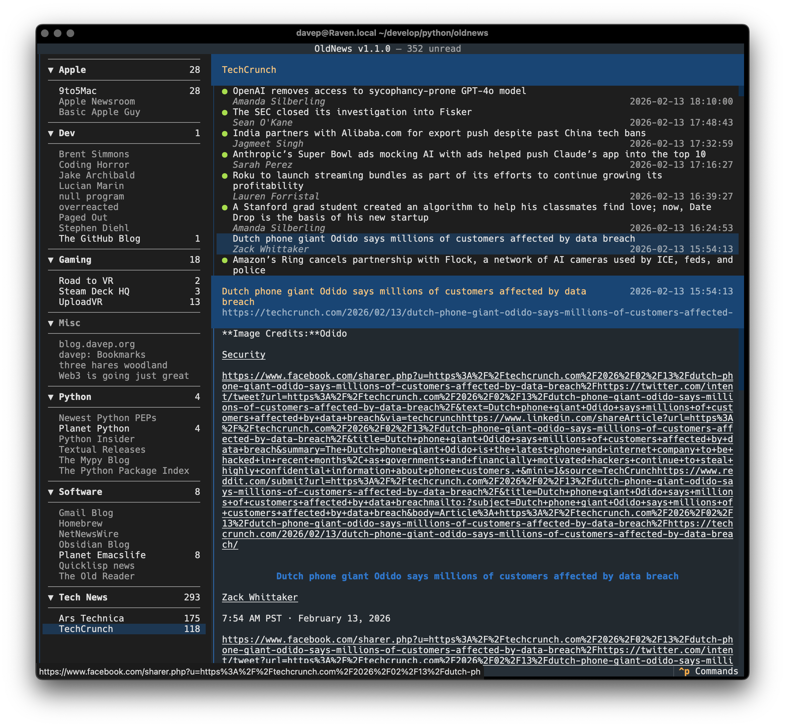
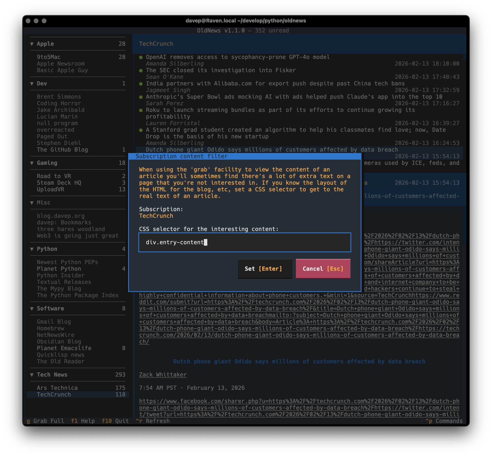
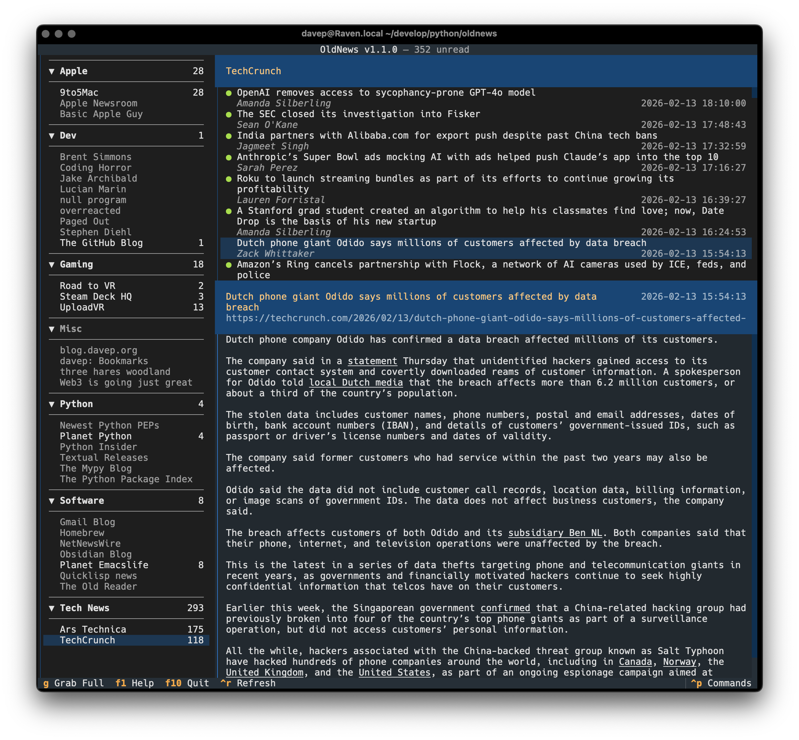

# Introduction

While some subscriptions will have feeds whose content is the full text of
the article you're reading, others will include just a small snippet of the
content, forcing you to have to leave your news reader of choice and visit
their website.

In OldNews I added a feature that, when presented with such a subscription,
you can grab the full content from the web (press <kbd>g</kbd> while reading
an article). The problem here is that some sites have a *lot* of extra
content that you're not interested in.

To improve on this I've added per-subscription article grab filters.

## Example use

Imagine you're reading an article where only the smallest of snippets is
available to read.

Not wanting to have to leap out of OldNews and into your web browser, you
hit <kbd>g</kbd> to grab more of the article.

So now you have the full article but there's far too much content showing,
much of it unreadable. This is where the filtering system comes in.

Using the `SetSubscriptionContentFilter` command (bound to <kbd>f</kbd> by
default) you can set a selector to use to find the readable content of the
page.

Knowing what selector to set will of course depend on you diving into the
source for the average article for the subscription and working out what
will work; in most cases this shouldn't be too difficult (if you know web
development and can navigate the source of a page).

After the filter is set, the article can be grabbed again and it will be a
lot more readable.

Having set the filter, this will always be used for any article you grab
(<kbd>g</kbd>) from that subscription.

[//]: # (grab_filters.md ends here)
